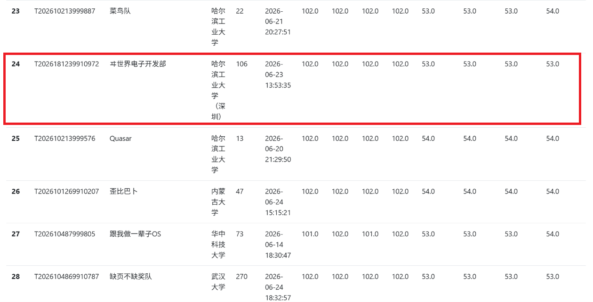

# Anemone

## 项目简介

Anemone 是一个使用 Rust 实现、支持 RISC-V64 与 LoongArch64 平台的操作系统内核。

在开发过程中，我们始终避免为了对特定测例进行特化适配而妥协系统设计。Anemone 的目标是：在 Linux ABI 兼容性、进程线程管理、虚拟内存、VFS 与文件系统、设备驱动模型、IPC、同步和体系结构适配等核心能力域上形成**可解释、可维护、可持续演进**的系统实现。

## 完成情况

### 初赛情况

截至初赛结束，Anemone 已经通过初赛测例的大部分测例，并通过了大量 LTP 测例点。



### Anemone内核介绍

- **进程管理** 实现 task / thread group / process group 等执行实体管理，覆盖 fork / clone / exec / exit / wait 等生命周期路径。
- **调度** 围绕 scheduler、wait-core、signal interruption 形成阻塞、唤醒与可中断等待路径。
- **内存管理** 实现地址空间、页表、缺页处理、匿名页、VMO / backing object、file-backed mapping、共享内存与内存压力相关路径。
- **IPC** 覆盖 signal、pipe、System V IPC、event/timer 类文件对象、poll/select 等等待组合路径。
- **文件系统** 实现 VFS、路径查找、mount view、opened file object、procfs、devfs 和多类文件后端的统一接入。
- **设备驱动模型** 实现设备发布、字符/块设备、ioctl 分发和若干具体设备对象。
- **时间** 围绕 clock、tick、IRQ / threaded soft timer、timerfd 和 itimer 组织时间线、超时与定时通知。
- **架构抽象层** 支持 RISC-V64 与 LoongArch64 的启动、trap、中断、上下文保存和平台差异收束


### 文档

- [初赛阶段文档](./report/build/anemone-report.pdf)
- [项目开发简介幻灯片](./report/Anemone初赛演示文稿.pptx)
- [演示视频](https://pan.baidu.com/s/1rhglWFYPBpUGX7G0ZbcY1A?pwd=kafu) 提取码：kafu

### 项目结构

```text
.
├── Justfile                    # 构建、格式化、运行入口
├── kconfig                     # 内核配置文件
├── anemone-book                # 高层设计文档
├── anemone-kernel              # 内核主体
├── anemone-abi                 # 内核与用户态共享 ABI
├── anemone-rs                  # Rust 用户态支持库
├── anemone-libc                # 用户态 libc
├── anemone-apps                # 用户态应用
│   ├── init
│   └── user-test
├── conf                        # 架构、平台和 rootfs 配置
│   ├── arch
│   ├── platforms
│   └── rootfs
├── symtab                      # 符号表辅助工具
├── scripts                     # 构建、运行和 QEMU 脚本
├── docs                        # RFC、devlog、register
└── report                      # 比赛的开发报告
```

内核主体按子系统拆分如下。

```text
arch       # RISC-V64 / LoongArch64 架构入口
exception  # trap、异常和中断入口
syscall    # Linux syscall 分发与 ABI 解析
task       # task、线程组、进程拓扑、信号和资源
sched      # 调度器、等待和运行队列
time       # 时钟、tick、timer、itimer 和时间 API
mm         # 地址空间、页表、物理页和缺页路径
fs         # VFS、mount、procfs、devfs 和文件系统后端
device     # 设备模型、设备发现和 I/O class
driver     # 块设备、串口、中断控制器、virtio 等驱动
sync       # 内核同步原语
crates     # 独立 crate
├── buddy-system
├── device-tree
└── la-insc
```

## 运行方式

### 编译
在项目的根目录执行

```bash
# 生成默认内核配置文件
just defconfig
# 构建最小根文件系统
just rootfs mkfs -c conf/rootfs/minimal.toml --sudo
# 构建内核
just build
```

### 运行

启动内核：

```bash
just xtask qemu --platform qemu-virt-rv64 --image build/anemone.elf | tee build/tmp.log
```

调整内核配置文件kconfig与根文件系统配置文件，即可构建运行LoongArch架构内核。

## 项目人员

哈尔滨工业大学（深圳）：
- 张正翰(doruche18@outlook.com)：进程管理，内存管理，文件系统，设备驱动，IPC，RISC-V架构适配，时间管理，syscall实现，文档撰写，测例支持。
- 陈函申(edgwunderline@outlook.com)：PCIe总线，进程管理，内存管理，LoongArch架构适配，测例支持。
- 指导老师：夏文，仇洁婷

## 参考

- [Linux](https://kernel.org) 设备驱动模型，虚拟文件系统
- [Zircon](https://fuchsia.dev) VMO架构
- [Chronix](https://github.com/PACTHEMAN123/Chronix) 用户态测例环境建立