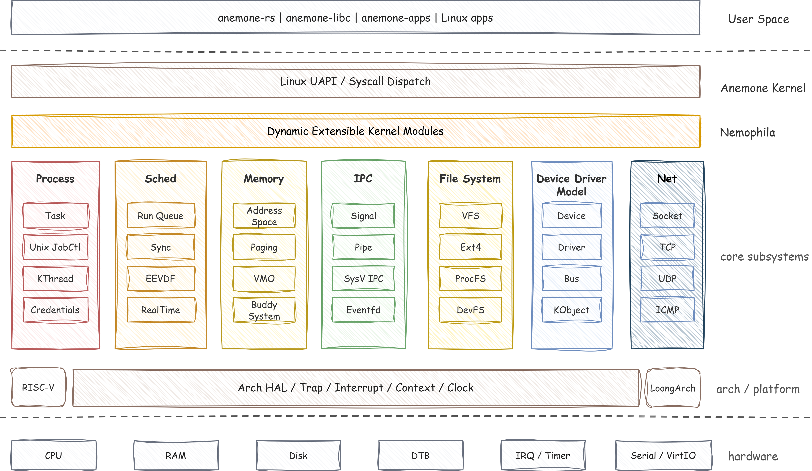
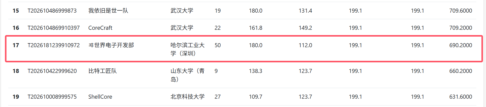

# Anemone

[](https://github.com/anemone-os/anemone/actions/workflows/ci.yml)
[](#许可证)
[](https://www.rust-lang.org/)
[](#跨架构而不是复制两套内核)

[English](./docs/README.en.md) | 简体中文

*本项目在[GitHub](https://github.com/anemone-os/anemone)进行开发.*

> 在边界对齐 Linux UAPI，在内核中保持 Anemone 自己的秩序。

Anemone 是一个使用 Rust 实现的多核类 Unix 宏内核，支持 RISC-V64 与 LoongArch64。它以兼容 Linux 用户态为目标，但不复制 Linux 的内部对象模型：进程、调度、虚拟内存、VFS、设备、Socket 与网络协议仍由职责清晰的 Anemone 子系统拥有。

从 QEMU 到 VisionFive 2 与 Loongson 2K1000，从系统调用测例到交互式 shell、网络工具和大型编译负载，Anemone 希望证明一件事：Linux 兼容性、跨架构可移植性和可维护的系统设计并不互相排斥。

Anemone 还通过 Nemophila 把清晰的内核边界延伸到运行期：以 WebAssembly 承载跨架构扩展，以 WIT 和 Weave 约束模块如何接入内核，并由统一 runtime 管理完整生命周期。



## 为什么是 Anemone？

### 在 ABI 边界兼容 Linux

Anemone 的系统调用层负责解析 Linux ABI、访问用户内存并把操作映射到内核对象；核心子系统保留自己的状态机、生命周期与错误边界。兼容性因此来自可组合的通用机制，而不是散落在测例路径中的特判。

这条原则贯穿多个子系统：调度器用自己的等待状态机处理阻塞、唤醒与信号竞争；VMO 统一承载匿名内存、文件映射、写时复制与共享 backing；VFS 区分路径、inode、opened file description 和具体后端；Socket 前端统一 Linux 文件接口，而 TCP、UDP、ICMP raw、Unix Socket 与 Netlink 各自拥有协议状态。

### 跨架构，而不是复制两套内核

Anemone 让内存、异常、调度、信号等使用方子系统定义所需的架构能力，再由 RISC-V64 与 LoongArch64 分别实现。架构层负责页表格式、trap frame、上下文切换、中断和指令等硬件事实，却不会反向拥有上层策略。

同一套核心内核目前覆盖：

- RISC-V64 与 LoongArch64；
- QEMU virt 虚拟平台；
- VisionFive 2 与 Loongson 2K1000 真实硬件平台；
- VirtIO MMIO、VirtIO PCIe、SD 卡、AHCI 等不同设备路径。

### 让内核在运行期继续演化

[Nemophila](./docs/src/contracts/nemophila/index.md) 是 Anemone 原生的受管理内核扩展框架。同一份 WebAssembly 模块制品可以运行在 RISC-V64 与 LoongArch64 上；WIT 定义语言无关的接口，Weave 则让各内核子系统主动提供类型化扩展点，只向模块投影完成任务所需的值。

Nemophila 用 WebAssembly 承载跨架构代码，用 WIT 约束接口，用 Weave 保留子系统所有权，再由 runtime 管理模块的装载、原子发布、回调准入、故障隔离、状态观测、卸载与重新装载。首批 Rust 模块已经接入任务创建与线程退出路径，并通过任务关系审计模块证明了从制品构建到真实内核事件的完整纵向路径。

### 状态所有权是一等设计原则

内核中最难维护的往往不是某个 syscall，而是并发操作之间“谁拥有当前事实、谁负责推进状态、失败后谁清理”。Anemone 尽量让每类状态只有一个 owner，并通过窄能力、token、snapshot 和重新检查通知跨越模块边界，避免共享私有对象或维护第二份状态真相。

网络栈是这一思路的集中体现：Linux Socket、协议端点、协议引擎与网卡资源分属不同层次；smoltcp 的 handle、buffer 和内部状态不会泄漏到内核 Socket。设备模型也把设备发现与驱动绑定同 VFS 文件接口分开，使虚拟机和真实硬件能够复用相同的块设备与文件系统上层。

### 从内核机制到完整系统

Anemone 不只交付一个 ELF——我们给出的是一个完整的、从内核到用户态、从五种配置文件到整个构建系统的整个生态。仓库同时组织内核、共享 ABI、用户态支持库、应用、rootfs、平台描述与构建配置，并由 `Justfile` 和 Rust `xtask` 从显式系统描述生成可启动产物。

当前系统可以承载交互式 shell、glibc 用户环境、进程与文件工具、`ping`、原生 iproute2、`apt install`、HTTPS `git clone` 以及大型软件编译。决赛测例与 BuildStorm 编译负载用于检验这些机制能否在完整路径中共同工作，而不只是证明孤立接口存在。

## 能力概览

- **动态扩展：** Nemophila WebAssembly runtime、WIT 接口、Weave 类型化扩展点、启动期与运行期装载、故障隔离、procfs 诊断、卸载重载和 Rust SDK。
- **进程与调度：** task / thread group / process group / session 生命周期，信号与 job control，Fair、FIFO、RR、Stride 调度类，多核负载均衡和统一 wait-core。
- **内存管理：** 物理页与页表、地址空间、VMO、按需分页、COW、共享内存、file-backed mapping、页缓存、TLB shootdown 与 OOM 防护。
- **文件与设备：** VFS、mount tree、Ext4、tmpfs、procfs、devfs，统一 opened file object，以及 bus / device / driver 模型。
- **IPC 与事件：** signal、pipe、System V IPC、eventfd、timerfd、poll / select / epoll 和 Unix Socket。
- **网络：** IPv4 TCP、UDP、ICMP raw、VirtIO-Net、Socket readiness、只读 Netlink diagnostics 与用户态网络工具链。
- **时间与架构：** clock / tick / timer、RTC、SMP 启动、trap、中断、IPI、上下文与信号现场、架构专属用户接口。
- **构建与验证：** 类型化 KernelConfig、Platform、SystemTarget 与 BuildPreset，双架构构建、rootfs 生成、QEMU / 实机产物和端到端测试入口。

完整设计说明见[内核技术报告](./report/kernel-report/)，当前开放问题与已接受限制见[活动登记册](./docs/src/register.md)。

## 成果与材料

截至当前决赛报告定稿时，Anemone 已通过全部决赛测例，并在 BuildStorm 编译测例中取得了有竞争力的性能结果。排名截图只反映对应时间点的比赛结果；具体设计、验证范围和未覆盖边界以技术报告与开发文档为准。



- [内核技术报告](./report/kernel-report/anemone-report.pdf)
- [BuildStorm 设计与优化报告](./report/buildstorm/)
- [决赛演示文稿](./report/ppt/Anemone决赛演示文稿.pptx)
- [初赛演示视频](https://pan.baidu.com/s/1rhglWFYPBpUGX7G0ZbcY1A?pwd=kafu) 提取码：kafu
- [决赛演示视频](https://pan.baidu.com/s/1MfxBOvz7EhgwaB0HWIXTzw?pwd=kafu) 提取码：kafu

## 使用 `just` 构建

推荐使用仓库提供的开发容器，或在本机准备与 `Dockerfile` 开发阶段等价的 Rust 工具链、交叉工具链和 QEMU 环境。构建与运行应通过 `Justfile` / `scripts/xtask` 进入；这些入口负责解析系统目标、生成配置与链接输入，并发布最终产物。

```sh
# 查看所有入口与可用配置
just --list
just conf list

# 构建 RISC-V64 / LoongArch64 QEMU release 内核
just build --preset qemu-virt-rv64-release
just build --preset qemu-virt-la64-release
```

默认内核产物发布到 `build/anemone.elf`。rootfs、QEMU、真实开发板以及比赛端到端复现需要显式选择相应平台和磁盘输入，详见[构建系统说明](./scripts/xtask/README.md)、[配置说明](./conf/README.md)与[端到端脚本](./scripts/README.md)。

## 项目结构

```text
.
├── anemone-kernel/     # 内核主体与内核侧独立 crate
├── anemone-abi/        # 内核与用户态共享 ABI
├── anemone-rs/         # Rust 用户态支持库
├── anemone-libc/       # C 用户态支持库
├── anemone-apps/       # init、测试、工具与示例程序
├── nemophila/          # 模块接口、Rust SDK 与示例模块
├── conf/               # KernelConfig、平台、系统目标、preset 与 rootfs
├── scripts/            # xtask、构建运行入口与端到端验证脚本
├── docs/               # 当前契约、RFC、开发记录与活动登记册
├── report/             # 技术报告、优化报告与展示材料
├── xref/               # 固定版本的外部实现参考
├── Cargo.toml
└── Justfile
```

## 开发文档

[`docs/`](./docs/) 记录当前有效的工程知识，包括：

- [开发工作流](./docs/src/development-workflow.md)
- [当前契约](./docs/src/contracts.md)
- [RFC 与重要设计决策](./docs/src/rfcs.md)
- [开发记录](./docs/src/development-log.md)
- [开放问题与当前限制](./docs/src/register.md)

README 是项目入口，不替代这些实时文档。能力边界、已知缺口和验证状态以当前源码及相应文档为准。

## 开发人员

哈尔滨工业大学（深圳）：

- 张正翰：进程管理、内存管理、文件系统、IPC、网络栈、设备驱动、RISC-V 架构适配、时间、syscall、文档与测例支持。
- 陈函申：PCIe 总线、进程管理、内存管理、LoongArch 架构适配、真实开发板移植与测例支持。
- 指导教师：夏文、仇洁婷。

## 许可证

除另有说明的第三方代码外，Anemone 采用 [MIT](./LICENSE-MIT) 或 [Apache License 2.0](./LICENSE-APACHE) 双许可证。


