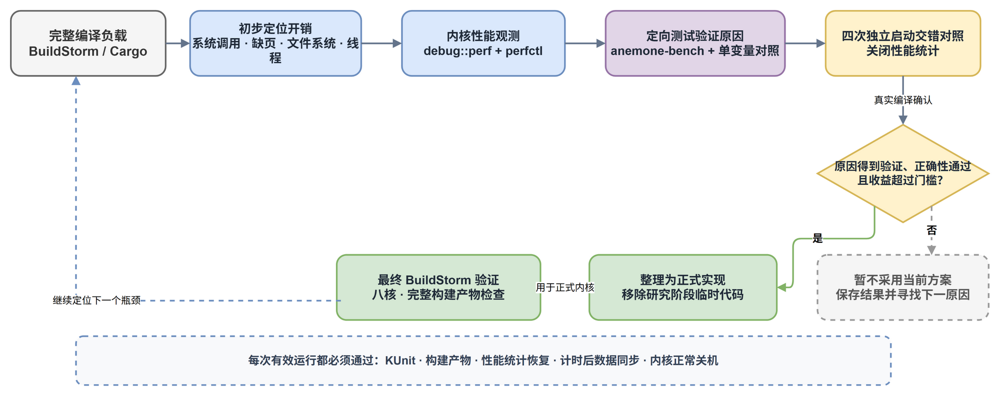
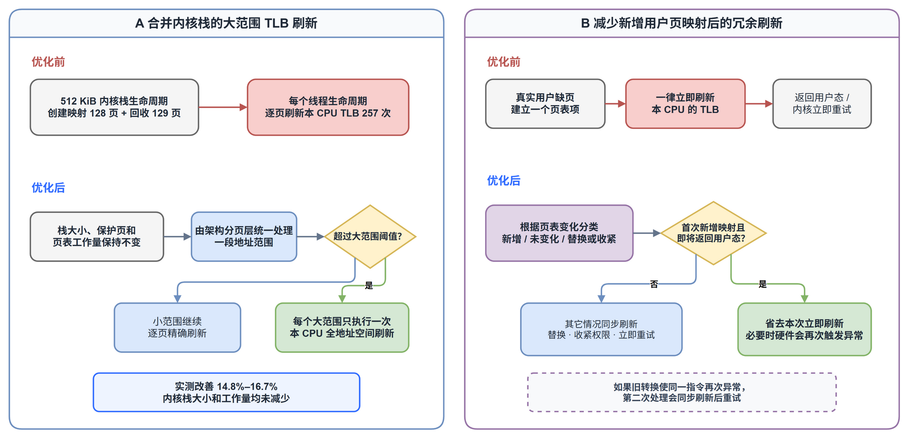
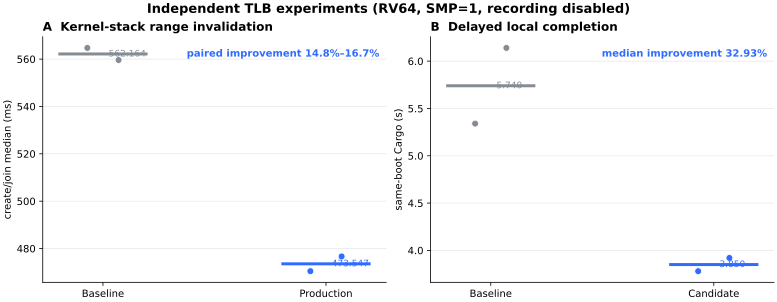
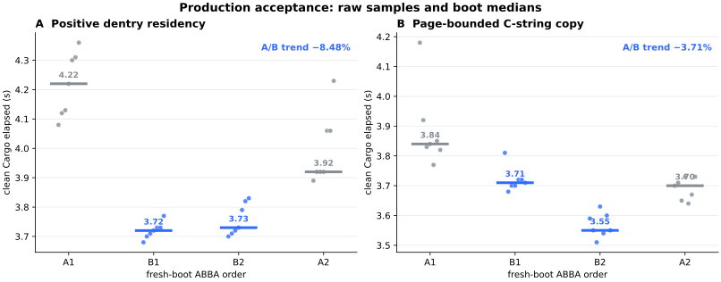

# Anemone BuildStorm 内核设计与优化报告

## 摘要

BuildStorm 要求操作系统在八核、8 GiB 的受控环境中，离线运行完整 Rust 工具链，并从源码构建 ArceOS 示例系统。构建过程持续数十分钟，会同时使用动态链接、进程与线程、虚拟内存、文件系统和多核调度，既检验内核能否稳定运行复杂软件，也检验这些基础能力的执行效率。

Anemone 没有删减构建步骤或放宽成功条件，而是先定位内核中的主要开销，再用完整编译负载确认优化是否真正有效。本文介绍三组代表性改进：减少不必要的 TLB 刷新、复用已经解析的文件路径，以及按页批量读取用户字符串。

| 优化方向 | 验证负载 | 实测结果 | 当前状态 |
| --- | --- | ---: | --- |
| 合并内核栈的大范围 TLB 刷新 | pthread 线程创建/回收 | 改善 14.8%–16.7% | 已用于正式内核 |
| 减少新增用户页映射后的冗余 TLB 刷新 | 清理构建目录后的 Cargo 编译 | 研究实验改善 32.93% | 优化策略及多核正确性已实现 |
| 复用已解析的目录项 | 清理构建目录后的 Cargo 编译 | 改善 8.48% | 已用于正式内核 |
| 按页批量读取用户字符串 | 清理构建目录后的 Cargo 编译 | 改善 3.71% | 已用于正式内核 |

: 代表性优化、验证负载与实测结果

这些百分比来自不同实验，不能相加，也不能直接当作最终 BuildStorm 的总加速比。最终提交的八核 RV64 内核已经完整通过 BuildStorm：构建命令成功返回，生成了 1,681,000 字节的目标文件，赛题计时为 1788.00 s。

为了避免只优化某个局部计数，我们还在内核中加入了默认关闭的性能观测能力，并配套开发了 `perfctl` 和 `anemone-bench`。它们用于定位耗时来源；正式计时会关闭这些统计功能，比赛配置则会将其完全移除。

## 1. BuildStorm：一场完整的软件构建

### 1.1 赛题如何运行和计时

赛方镜像预置 Debian/glibc 用户态、Rust 工具链、tgoskits 源码和 Cargo 离线缓存。测试首先检查 `rustc` 和 `cargo` 是否可用，然后在 `/tmp` 创建、编译并运行一个最小 Rust 项目。计时前还会尝试预编译 `tg-xtask`；本报告采用的正式运行确认该步骤成功，因此这部分时间没有计入最终成绩。

正式计时只覆盖以下命令：

```text
cargo xtask arceos build -p arceos-helloworld --arch <arch>
```

实际调用链为 `cargo xtask -> tg-xtask -> Tokio/axbuild -> ArceOS build`。测试设置 `CARGO_NET_OFFLINE=true`，不会在运行时下载依赖。计时由虚拟机内的 `/proc/uptime` 完成。

赛方以以下条件判定完整构建成功：

- 构建命令返回 0；
- 目标文件确实存在；
- 目标文件不少于 500,000 字节；

在此基础上，本报告只采用测试程序正常结束、内核完成关机且 QEMU 成功退出的运行作为最终结果。因此，报告中的时间对应一次真正完成的构建，而不是只执行了部分步骤的短路径。

### 1.2 为什么它能检验整个内核

BuildStorm 不是单一系统调用的速度测试。Cargo 和 Tokio 会创建进程、线程并执行异步 I/O；`rustc` 会大量映射文件、分配内存、触发缺页并生成中间文件；链接器和文件系统需要持续处理路径、元数据和缓存页。一次成功构建至少要求：

- glibc 动态程序能够加载并长时间稳定运行；
- fork/exec/wait、信号、futex、pipe 和 epoll 等进程协作功能正确；
- mmap、写时复制、用户内存访问和 TLB 刷新在持续负载下可靠；
- ext4、VFS 路径解析、文件映射和数据回写能够承载数百个 crate；
- 八个逻辑 CPU 能够并行推进，并保持页表、调度和资源回收正确。

### 1.3 只比较完整有效的运行

局部优化实验也采用相同原则。每次启动都必须通过内核单元测试和工作负载结果检查，计时结束后完成数据同步，性能统计开关恢复正常，最后由内核正常关机。panic、启动失败、产物错误或异常退出都会使整次启动作废，其时间不会进入统计。

这些检查保证原版本和优化版本完成相同工作，也防止偶然失败或残缺产物被误当成“更快”。

## 2. 我们如何确认优化确实有效



### 2.1 三层测试分别回答三个问题

我们没有直接从一次完整 BuildStorm 时间猜测瓶颈，而是依次使用三类负载：

| 负载或工具 | 回答的问题 | 不能单独证明什么 |
| --- | --- | --- |
| `anemone-bench` 定向测试 | 某项内核机制为什么昂贵 | 最终赛题能加速多少 |
| 清理构建目录后的 Cargo 编译 / 直接运行 `rustc` | 改动能否改善真实编译 | 不同实验的百分比能否相加 |
| 完整 BuildStorm | 最终系统能否成功构建、实际耗时多少 | 某一个内核子系统贡献了多少 |
| `debug::perf` / `perfctl` | 预期代码路径是否执行、工作量是否变化 | 开启统计时的时间能否作为最终成绩 |

: 三层验证负载各自承担的结论

定向测试负责把问题缩小。例如线程创建较慢，原因可能是调度、futex、任务创建，也可能是每个线程内核栈引发了大量页表刷新。只有分别测量这些路径，才能知道应该改哪里。

### 2.2 内核自带的性能观测能力

`debug::perf` 可以记录事件次数、耗时分布和累计执行时间，并按 CPU 保存数据。系统调用 `perf_observe` 提供控制和读取接口，用户工具 `perfctl` 负责列出指标、运行命令并比较运行前后的统计值。`anemone-bench` 则提供线程、虚拟内存和纯 CPU 对照等定向负载。

这些统计只用于回答“优化是否走到了预期路径”和“工作量是否保持一致”。确定原因后，我们会关闭统计，再比较原版本和优化版本的运行时间。最终比赛配置还设置 `perf_observe=false`，从内核二进制中完全移除指标表、存储空间和相关系统调用，避免诊断功能影响成绩。

### 2.3 四次独立启动的交错对照

正式比较采用 `A1 -> B1 -> B2 -> A2` 的顺序：A 表示原版本，B 表示优化版本，每一次都重新启动虚拟机。中间连续运行两次 B 可以减少重复切换构建环境的成本，两侧的 A 则用于发现宿主机负载随时间变化造成的漂移。

进入这组对照前，会固定代码版本或补丁、内核配置、根文件系统模板、运行命令、重复次数和样本排除条件。正式采用的优化通常还要满足三个条件：改善超过预先设定的 3% 实用门槛；两组相邻比较方向一致；纯 CPU 对照不能完整解释该改善。

## 3. 三项关键优化

### 3.1 减少不必要的 TLB 刷新

TLB（地址转换后备缓存）保存虚拟地址到物理地址的近期转换结果。页表发生变化后，内核必须在必要时清除旧结果；但如果刷新范围过细或时机过于保守，同一操作就会重复执行大量刷新指令。



#### 内核栈：大范围一次刷新

默认 512 KiB 内核栈包含 128 个映射页和一个保护页。旧实现在线程创建时逐页刷新 128 次，回收时再刷新 129 次，一个完整线程生命周期共执行 257 次。测试中的 2506 个线程生命周期因此产生 5,012 次范围操作，涉及 644,042 个页面。

新实现保持内核栈大小、保护页和页表工作量不变，只改变刷新方式：小范围仍逐页精确刷新；超过 Kconfig 阈值的大范围改为一次刷新本 CPU 的整个地址空间。RV64 定向实验的两组相邻比较分别改善 16.7% 和 14.8%。统计结果同时确认，5,012 次大范围操作全部采用了新路径，因此收益不是通过缩小内核栈或减少测试工作取得的。

#### 用户缺页：新增映射不再一律立即刷新

进程第一次访问尚未分配的页面时会触发缺页异常，内核随后建立页表项。旧实现每次建立页表项后都会立即刷新本 CPU 的 TLB，即使这是第一次新增映射、硬件不可能持有该地址的旧有效转换。

新实现区分两类情况：如果只是第一次新增映射，并且处理完成后马上返回用户态，可以省去本次立即刷新；如果是替换映射、收紧权限，或者内核需要马上重新访问该地址，仍然同步刷新。如果硬件确实缓存了不适用的转换并再次触发异常，第二次处理也会进入同步刷新路径。

冻结的 RV64/QEMU Cargo 实验中，中位数从 5.740 s 降至 3.850 s，改善 32.93%；统计显示 97% 以上的真实用户缺页属于可以省去立即刷新的新增映射。这一百分比用于证明优化方向，不等同于最终 BuildStorm 的独立增益。

#### 多核正确性：只通知可能持有旧转换的 CPU

多核系统还需要确保其它 CPU 不再使用旧页表。Anemone 为每个用户地址空间记录当前实际运行过它的 CPU 集合，只向这些 CPU 发送同步刷新请求，并在全部 CPU 确认完成后再释放旧页表或物理页。

这既避免无差别打扰所有 CPU，也保证资源不会在旧转换仍可能被使用时提前回收。相关正式代码版本列在[复现身份索引](./evidence/reproducibility.md)中。



### 3.2 复用已解析的目录项

VFS 使用目录项（dentry）表示一次文件名解析结果。Cargo 和 `rustc` 会反复打开源码、元数据和中间文件；旧实现不主动保留已经成功解析的目录项。当最后一个使用者释放引用后，下次访问相同路径仍要重新查询 ext4。

研究实验先加入有界保留队列，确认重复查询确实是主要开销：ext4 查询次数从 4,418 降至 638，减少 85.56%，而总路径查询次数仍为 13,520。这说明工作没有被删除，只是更多请求直接复用了 VFS 已知结果。

正式实现为每个 ext4 文件系统实例保留最多 1024 个已经成功解析的目录项。删除、重命名等命名空间变更会立即使对应记录失效；容量不足时只是不再保留，不会改变系统调用结果。最后一个挂载视图卸载时，相关引用也会全部释放。

在 RV64、单核、8 GiB 的 Cargo 四次交错对照中，原版本两次启动的中位数趋势为 4.070 s，优化版本为 3.725 s，改善 8.48%；直接运行 `rustc` 时同向改善 11.21%。四次启动都通过完整内核单元测试、构建产物检查、数据同步检查，并由内核正常关机。

### 3.3 按页批量读取用户字符串

open、exec 等系统调用需要从用户空间读取以 NUL 结尾的路径字符串。旧实现逐字节检查和读取，能够准确处理非法地址、跨页和最大长度，但每个字节都会重复建立用户内存访问窗口。

新实现一次最多读取 256 字节，并始终停在当前页边界、用户地址上界或字符串长度上限之前。因此它减少了重复检查，又保持以下行为不变：遇到 NUL 立即结束；跨页时重新检查下一页；不可访问地址仍返回原错误；UTF-8 和过长字符串沿用原有处理。

参数实验比较了 64、128、256 和 512 字节。对于 2,399 次字符串读取和 162,542 个有效字节，256 与 512 都只需要 2,405 次页内批量读取，而 512 会额外读取更多无用字节，因此正式实现选择 256。

RV64 Cargo 四次交错对照中，原版本中位数趋势为 3.770 s，优化版本为 3.630 s，改善 3.71%；两组相邻比较分别改善 3.39% 和 4.05%。



### 3.4 没有端到端收益的候选不会进入正式内核

降低某个计数器或减少几条指令，并不必然改善完整编译。我们也保存了三个有代表性的筛选结果：

| 候选 | 局部结果 | Cargo 结果 | 处理方式 |
| --- | --- | --- | --- |
| 空信号返回快速路径 | 99.79% 的用户态返回走快速分支 | 改善 5.03% | 正式采用 |
| 页表范围遍历器 | 页表槽检查减少约 84.9% | 两组相邻对照均未改善 | 确认为非当前主要瓶颈 |
| 用户内存 8 字节宽访问 | 57.010% 的字节走宽访问；双架构正确性通过 | 未超过 3%，且顺序漂移明显 | 暂不采用 |

: 候选优化的局部结果、Cargo 结果与处置

后两项说明，局部工作量下降和高执行覆盖率仍不足以证明系统会更快。只有在真实编译中形成稳定收益的改动，才值得增加到长期维护的内核代码中。

## 4. 八核 BuildStorm 最终结果

主结果使用赛方 `final-2026@b5ec6ef8497e1818cbdec3b54bb722f036e57972` 工作负载、八个逻辑 CPU 和 8 GiB 内存。最终配置从内核中移除了 KUnit、符号表、软件非对齐访问回退和性能观测等比赛运行不需要的诊断功能。两个架构都由虚拟机内的 `/proc/uptime` 计时，只覆盖 `cargo xtask arceos build ...`。

| 架构 | Anemone 源码 | 构建配置 | 完整日志 |
| --- | --- | --- | --- |
| RV64 | `27110b6973c5` | `competition-final-rv64-release`；`conf/kconfs/final.toml`；SMP=8；8 GiB | [`buildstorm-rv64-smp8.log`](./evidence/logs/buildstorm-rv64-smp8.log) |
| LA64 | `a0c7bbe6b811` | `qemu-virt-la64-final`；`conf/kconfs/default.toml`；release；SMP=8；8 GiB | [`buildstorm-la64-smp8.log`](./evidence/logs/buildstorm-la64-smp8.log) |

: 双架构 BuildStorm 运行身份与配置

| 架构 | 证据性质 | 工具链 / 最小构建 | 完整构建 | 虚拟机内计时 | 产物大小 |
| --- | --- | --- | --- | ---: | ---: |
| RV64 | 当前提交主结果 | 通过 / 通过 | 成功 | 1788.00 s | 1,681,000 字节 |
| LA64 | 既有完整运行记录 | 通过 / 通过 | 成功 | 1153.00 s | 1,714,568 字节 |

: RV64 与 LA64 八核 BuildStorm 完整运行结果

RV64 日志确认测试程序正常结束，内核完成关机，QEMU 成功退出。LA64 数据来自既有完整运行记录，只用于证明同一复杂负载能够在 LA64 上完整运行。两个架构都只有一次有效完整运行，因此本报告只列出精确值，不生成范围或中位数，也不进行跨架构性能排名。

局部实验的百分比不能相加为 BuildStorm 加速比。它们使用的负载和配置不同，而且多个优化会相互影响：目录项复用会改变系统进入用户内存访问和缺页路径的次数，TLB 优化也会同时影响线程和内存管理。完整 BuildStorm 时间才是这些实现共同作用后的最终结果。

## 5. AI 使用与结果复现

本项目使用 AI 辅助检索代码和研究材料、提出候选、检查代码、编排重复实验和整理文档。实验条件、正确性检查、正式采用决定和最终机制解释均由团队确认。

每项主要结果都记录了原版本和优化版本的代码身份、运行配置、命令、检查条件和结果摘要。详细身份见[复现身份索引](./evidence/reproducibility.md)，原始数值见[`results.csv`](./evidence/results.csv)；代表性优化的详细说明列在文末附录中。

最短复现流程为：

1. 检出表中指定的 Git 提交，或在指定版本上应用固定补丁；
2. 使用记录的仓库构建配置和参数，不以裸 `cargo` 命令替代；
3. 从同一只读模板创建新的运行磁盘；
4. 按记录顺序运行负载，并检查产物、数据同步和正常关机；
5. 只比较 `results.csv` 中测试配置相同的结果。

## 6. 总结

Anemone 已经能够在八核、8 GiB 环境中完整运行离线 Rust 工具链，并从源码构建 ArceOS。围绕这一真实负载，我们分别减少了大范围页表更新中的重复 TLB 刷新、复用了已经解析的文件路径，并将用户字符串读取从逐字节处理改为不跨页的批量处理。

这些改进都保留了原有工作量和正确性要求，并经过定向测试、真实 Cargo 编译和独立启动对照逐层确认。最终 RV64 比赛配置以 1788.00 s 完成 BuildStorm，生成 1,681,000 字节的有效产物；LA64 既有完整日志也确认了同一复杂软件负载可以成功运行。

## 附录与公开证据

### 优化研究

- [TLB 优化研究](./appendices/tlb-optimization.md)
- [复用已解析的目录项](./appendices/positive-dentry-residency.md)
- [按页批量读取用户字符串](./appendices/page-bounded-c-string-copy.md)
- [候选筛选记录](./appendices/candidate-screening.md)

### 复现材料

- [复现身份索引](./evidence/reproducibility.md)
- [原始实验数据](./evidence/results.csv)
- [新增用户页映射实验补丁](./evidence/patches/user-fault-local-tlb.patch)
- [RV64 八核 BuildStorm 完整日志](./evidence/logs/buildstorm-rv64-smp8.log)
- [LA64 八核 BuildStorm 完整日志](./evidence/logs/buildstorm-la64-smp8.log)
